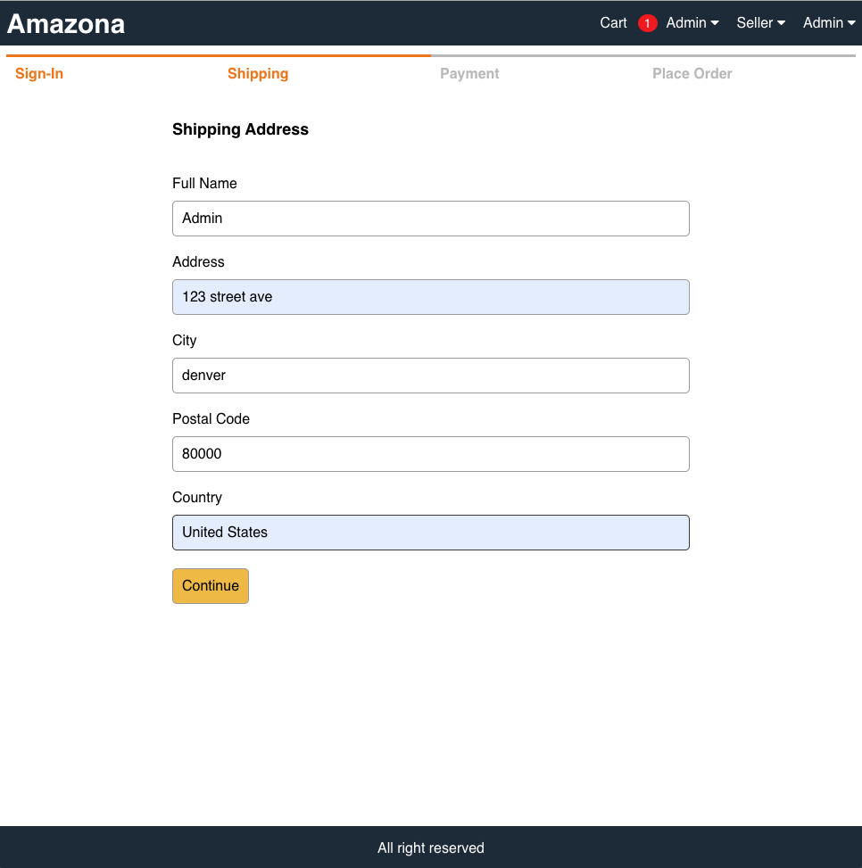
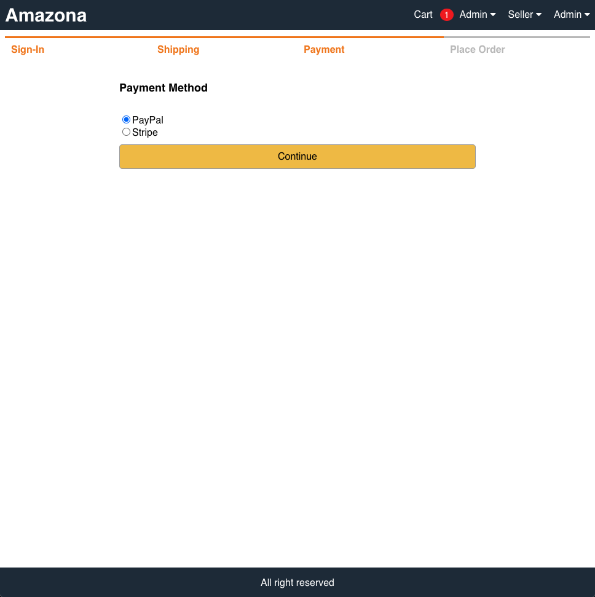
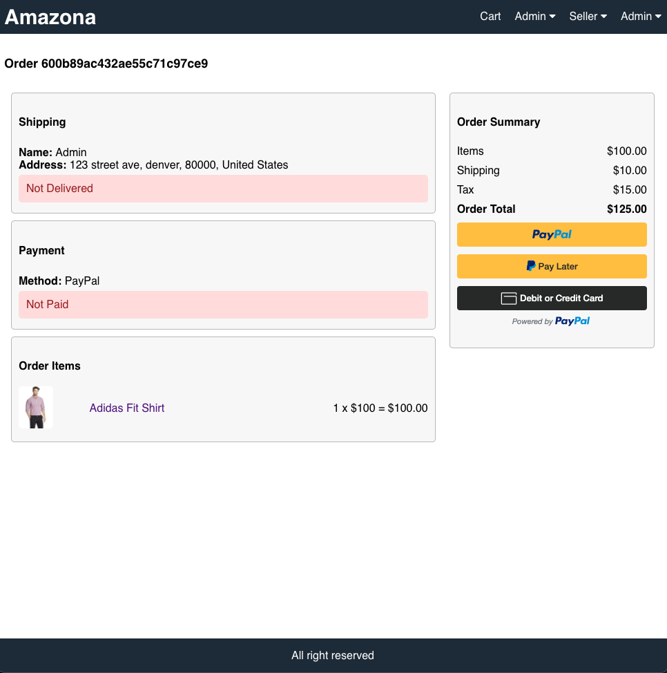
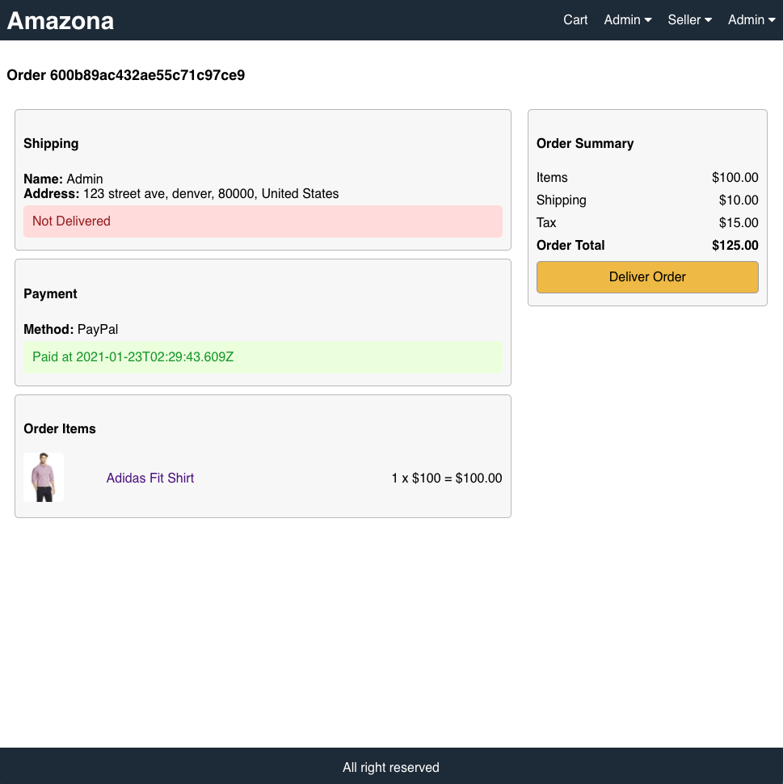
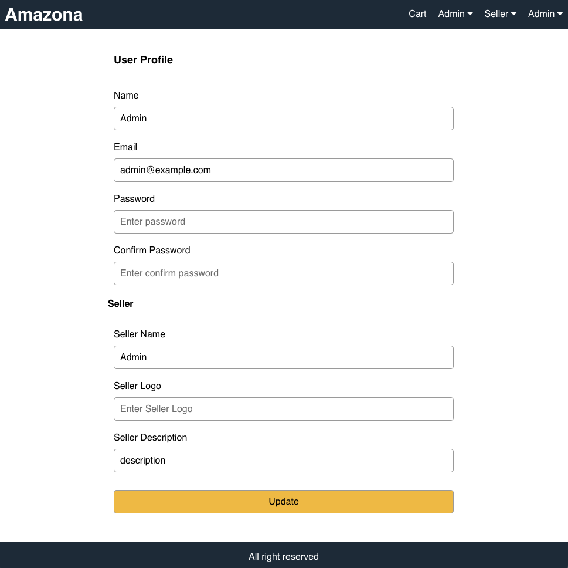
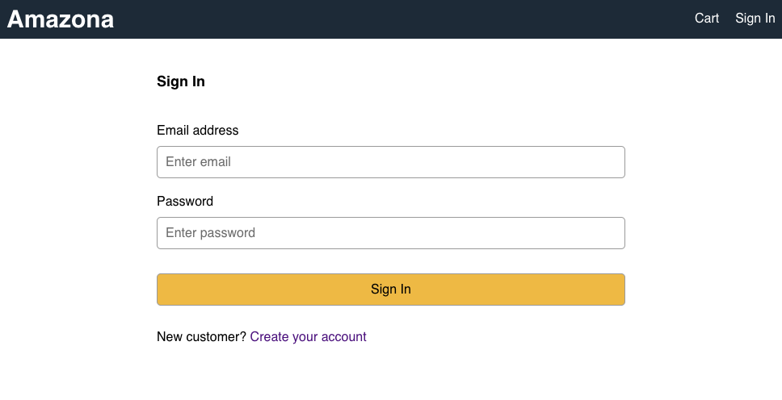
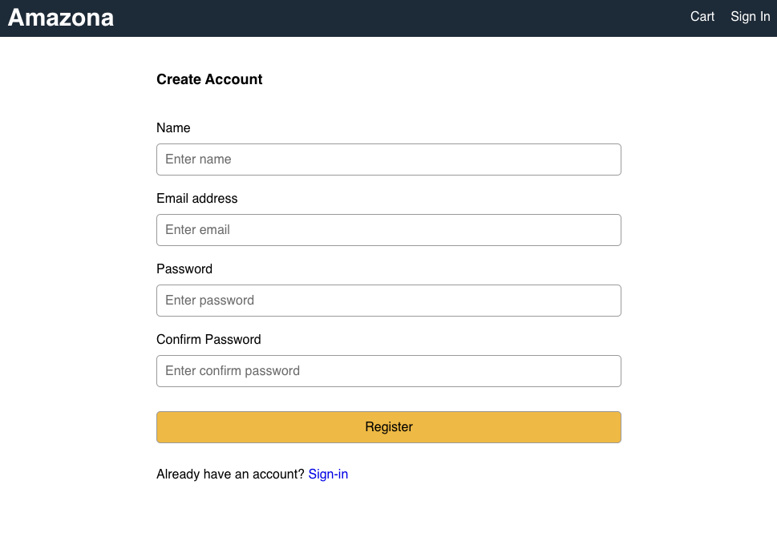

# Amazona

An Amazon clone e-commerce website build with React, Redux, NodeJS, JavaScript, MongoDB, and React-Bootstrap.

## Project Status

This project is completed enough to showcase my skills. The website include Products List, Product Details, Shopping Cart, Checkout Process, Admin Pages, Profile, Order, Sign-in, and Sign-out screens. Functionalites like User Authentication & Authorization, Interaction with the Shopping Cart, PayPal payment API.

The project is live at: https://phih-amazona.herokuapp.com

## Reflection

This was a 3 week long project built as a side project to learn and improve my MERN stack development skill.

The project was mean to be a simple e-commerce website that can display the products, add and remove items to shopping cart, checkout process, view user profile and orders.

The notable technologies implemented in this project are Redux for State Management, JWT for User Authentication, PayPal API.

## Installation

1. Clone this repo. You will need node and npm installed on your machine
2. Open the project in your IDE and run the following command on your command line:
```
npm install
cd frontend
npm install
```
3. Create a .env file in the root with the following:
```
PORT = 5000
MONGO_URI = your mongodb uri
JWT_SECRET = 'abc123'
PAYPAL_CLIENT_ID = your paypal client id
```
4. Then you can run the below command to run the server/backend of the project:
```
npm start
```
Open the new command line and run the frontend of the project:
```
cd frontend
npm start
```

## Screen Shots

Home / Product List Screen


Product Details Screen


Shopping Cart Screen


Shipping Address Screen



Payment Method Screen



Place Order Screen


Payment Screen



Order Screen



User Profile



User Order History Screen


Admin User List Screen


Admin/Seller Product List Screen


Admin/Seller Order List Screen


Sign-in Screen



Sign-up Screen


